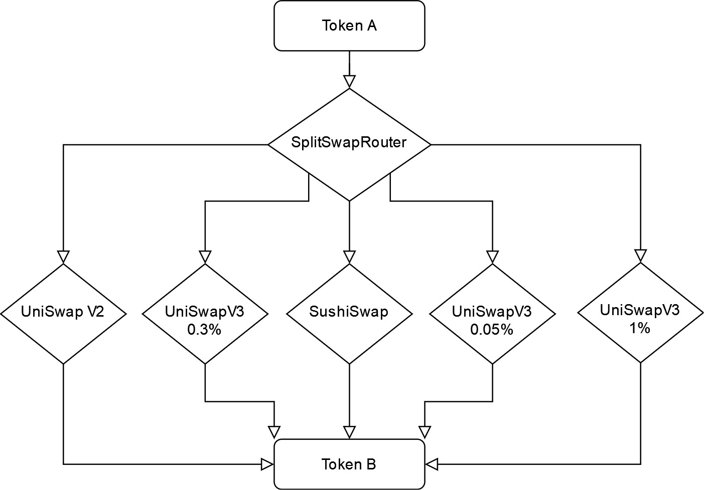

# Split Swap Router 

### Optimal Swap split between Sushiswap, Uniswap V3 and Uniswap V2 (IUniswapV2Router compatible)

Based on math derived in [MEV paper by Liyi Zhou et al.](https://arxiv.org/pdf/2106.07371.pdf)

[Math derivations for application in EVM](docs/math.md)

[Algorithm applying derived math](docs/algo.md)

Pools 
- Sushiswap
- Uniswap V2
- Uniswap V3 0.30%
- Uniswap V3 0.05%
- Uniswap V3 1.00%

[Uniswap V3 virtual reserves calculation](docs/virtual-reserves.md)

<!--  -->


## Ethereum, Polygon, Optimism, Arbitrum
Using the path given, `SplitSwapRouter` optimally splits swaps across pools from Uniswap V3, Uniswap V2 and Sushiswap.

## Avalanche and Fantom
Using the path given, `SplitSwapRouterLite` optimally splits swaps across pools from TraderJoe / Spookyswap and Sushiswap.

## Deployments

| Contract               | Deployment address                           | Network     |
|------------------------|----------------------------------------------|-------------|
| `SplitSwapRouter`      | [0x77337dEEA78720542f0A1325394Def165918D562](https://etherscan.io/address/0x77337deea78720542f0a1325394def165918d562) | Eth Mainnet |
| `MultiSplit`      | [0xA9b07a3039ADc6b2c6cA1e4A76F240A7b8D66409](https://etherscan.io/address/0xA9b07a3039ADc6b2c6cA1e4A76F240A7b8D66409#code) | Eth Mainnet |
| `SplitSwapRouterLite`  | [0x7726E85aF071dD93366fe9C5C2dCbCe6276F568a](https://polygonscan.com/address/0x7726e85af071dd93366fe9c5c2dcbce6276f568a) | Polygon Mainnet |
| `SplitSwapRouterLite`  | [0xB76f8AE19dC12815D63FFbB5059F6B5fB5c03B70](https://snowtrace.io/address/0xb76f8ae19dc12815d63ffbb5059f6b5fb5c03b70) | Avalanche C chain |
| `SplitSwapRouterLite`  | [0xb064944d5d6cF5D453F0FEe4BdE2FB6B85534d95](https://ftmscan.com/address/0xb064944d5d6cf5d453f0fee4bde2fb6b85534d95) | Fantom |


## Developer Setup
Copy `.env-example` to `.env` and fill in `ETH_RPC_URL`.
```sh
source .env
```

## Build
```sh
forge build
```

## Fuzz tests

Fuzz test all methods on `SplitSwapRouter` produce better results than Sushiswap, on ethereum network.
```sh
forge test -f "$ETH_RPC_URL" -vvv --match-contract SplitSwapRouterFuzzTest
```

[Fuzz test result](docs/fuzz-test.md)


Fuzz test all methods on `SplitSwapRouterLite` produce better results than Sushiswap, on ethereum network.
```sh
forge test -f "$ETH_RPC_URL" -vvv --match-contract SplitSwapRouterLiteFuzzTest
```

[Fuzz test lite result](docs/fuzz-test-lite.md)

## Edge case tests (negatives and random pairs)

Test reverts execute as expected and random pairs are picked for swap testing.
```sh
forge test -f "$ETH_RPC_URL" -vvv --match-contract SplitSwapRouterEdgeTest
```

[Test result](docs/edge-test.md)


## Benchmarking against 1-Inch v4

`SplitSwapRouter` uses ~20% of the gas of 1-Inch with an output $\pm$ 1%. Moreover, no external API call for an offchain aggregator is needed.

### Run the tests

Dynamic Api test uses 1 inch API to get best route for a current large swap, passing the data to the test script for simulated execution against `SplitSwapRouter`.

```sh
source ./script/1inch-api-test.sh
```

[Dynamic api test result](docs/1inch-test.md)

In addition, benchmark on-chain transactions from 1-Inch V4 have been recorded, to fork and test against:

- [450 ETH -> 850,818 USDC (block 15347844)](https://etherscan.io/tx/0x3e506fb505c538805752e419356c3a6ce8b05a29d34ca563c95e894fda75bf80)
- [797 ETH -> 61 WBTC (block 15408223)](https://etherscan.io/tx/0x36eeb2248b7fc1f95bfbbf3be467ac70018a7c53120e3ec4da716707e08c01f0)
- [100 ETH -> 170,278 DAI (block 15409162)](https://etherscan.io/tx/0xa9d979dc02f5a5293431d015e0eb6c9eea963dbe4a00cccd556d703eb3b91bb1)
- [123 ETH -> 209,720 USDT (block 15409150)](https://etherscan.io/tx/0xf2c30b239cd6f77427b2998b930eff3c0eb4bb50a92f7993d379484161c89480)
- [2.8 MKR -> 1.4 ETH (block 15396937)](https://etherscan.io/tx/0xd851a00e54dace8f77cd7e6f25c28818177ac3e1f5a3b18795a9c747723cb7a9)

```sh
forge test -f "$ETH_RPC_URL" -vvvvv --match-contract SplitSwapRouterVS1inchTest --etherscan-api-key $ETHERSCAN_API
```

[Benchmark test result](docs/benchmark-test.md)

## Multi Split test

Batch multiple swaps into one call.

```sh
forge test -f "$ETH_RPC_URL" -vvvvv --match-contract MultiSplitFuzzTest --etherscan-api-key $ETHERSCAN_API
```

[Multi Split test result](docs/multi-split-test.md)


## Test invest

A little off-chain knowledge can turn `SplitSwapRouter` into a smart order router, by simply knowing possible routes and their relative reserves upfront. This can be acheived with a front-end interface [as with this one by Manifold](https://github.com/manifoldfinance/SplitSwapRouter-UI/). As a working example, we show the gain for a FOLD investor using `SplitSwapRouter` with 2 routes. 

Trade 140 ETH -> FOLD 
- best route would be determined by knowing the pools upfront:
  - [3 Uniswap V3 pools (containing ETH-FOLD & USDC-FOLD)](https://info.uniswap.org/#/tokens/0xd084944d3c05cd115c09d072b9f44ba3e0e45921)
  - [1 sushi pool (ETH-FOLD)](https://analytics.sushi.com/pairs/0xa914a9b9e03b6af84f9c6bd2e0e8d27d405695db)

- i.e. 2 Possible routes
  - USDC-FOLD (preceded by ETH-USDC) ~ $1m
  - ETH-FOLD ~ $1.5m

Assuming prices are roughly equal, the optimal route split is by reserve ratios:
 - send 140 ETH * 1m/(1m+1.5m) to `SplitSwapRouter` with a path ETH -> USDC -> FOLD
 - send 140 ETH * 1.5m/(1m+1.5m) to `SplitSwapRouter` with a path ETH -> FOLD

On each call `SplitSwapRouter` will further split between like pools. Simulating the case above would yield the investor 50% more FOLD than swapping on sushiswap.

```sh
forge test -f "$ETH_RPC_URL" -vvvvv --match-contract SplitSwapRouterInvestTest --etherscan-api-key $ETHERSCAN_API
```

[Test output](docs/invest-test.md)

## Test deploy
Ethereum mainnet:
```sh
forge script script/Deploy.s.sol:DeployScript --rpc-url $ETH_RPC_URL
```

Polygon mainnet:
```sh
forge script script/Deploy.s.sol:DeployScript --rpc-url $POLYGON_RPC_URL
```

Avalanche mainnet:
```sh
forge script script/DeployLite.s.sol:DeployLiteScript --rpc-url $AVALANCHE_RPC_URL
```

Fantom mainnet:
```sh
forge script script/DeployLite.s.sol:DeployLiteScript --rpc-url $FANTOM_RPC_URL
```

## Deploy and verify on etherscan
Fill in `PRIVATE_KEY` and `ETHERSCAN_KEY` in `.env`.

```sh
./script/deploy-eth.sh
```

### Todo

- [ ] MockERC20 and factories for faster fuzz testing
- [ ] Weth10 integration
- [ ] Gas optimisation

### In Progress

### Done ✓

- [x] Derived uint equation for amounts to sync prices and optimally splitting equal price markets via cumulative reserve ratios
- [x] IUniswapV2Router compatible
- [x] Split swaps between Sushiswap, Uniswap V2 and Uniswap V3
- [x] Edge case handling
- [x] Testing
- [x] Cross-chain compatible
- [x] Benchmark performance vs 1inch v4
- [x] 1inch v4 dynamic api test
- [x] Documentation of derived math and code
- [x] Modify `SplitSwapRouterLite` for multi-chain
- [x] Deployment scripts for multi-chain
- [x] Deploy multi-chain
